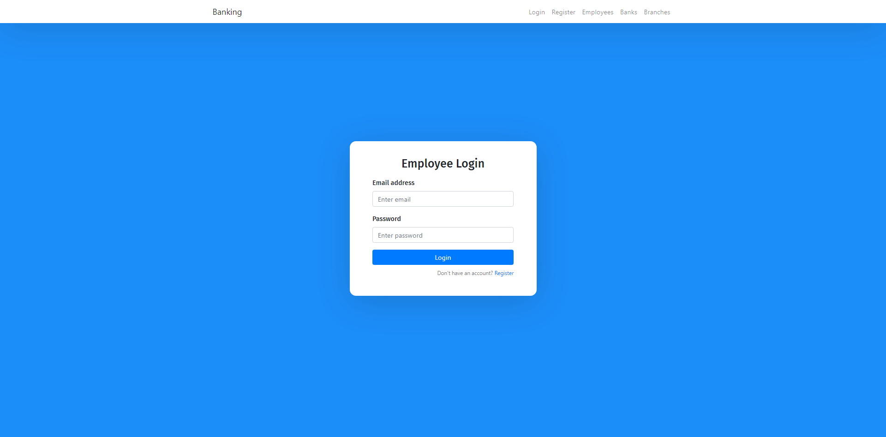

# Assignment - Kongcepts

This repository contains a sample CRUD application developed using React, Express and MongoDB.

## Runtime
- npm v6.9.0
- MongoDB v4.0.10

## Configurations
Please create .env with following configurations
```dotenv
MONGODB_URL=mongodb://127.0.0.1:27017/kongcepts_sample

JWT_SECRET=

JWT_TIMEOUT_DURATION="2 hours"

PORT=3001
```

## Deployment information
Create MongoDB database and import database dump located in database folder.
```dotenv
mongorestore --db databasename --verbose <dumpfolder>
```
Run the API service
```sh
cd API
npm start
```
Run the UI client
```sh
cd Frontend
npm start
```

## Sample UI

